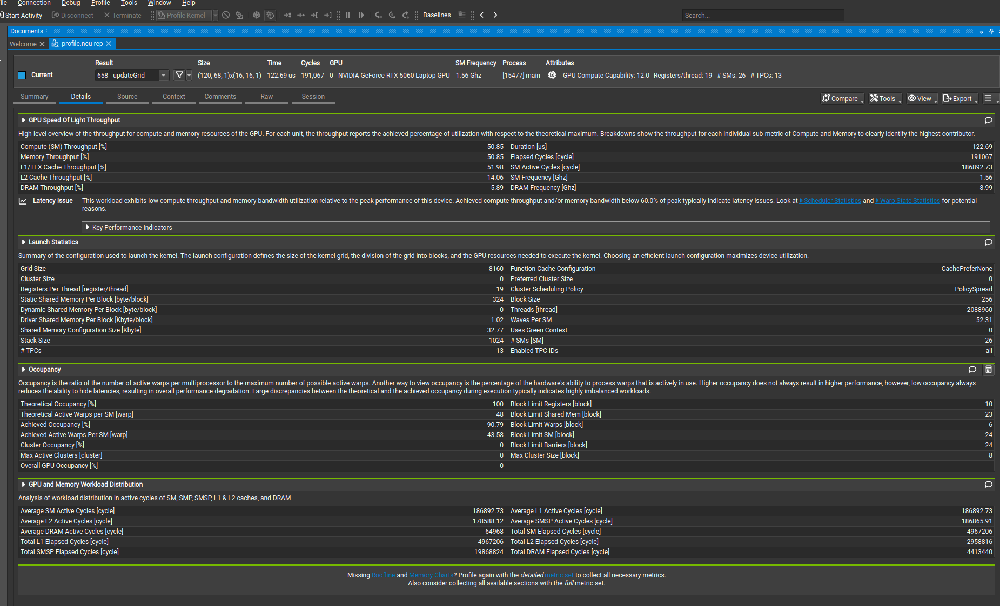

# CUDA Conway's Game of Life

Conway's Game of Life, but GPU-accelerated using CUDA and rendered with OpenGL through CUDA-GL interop.

Launches full screen in Full HD (1920x1080) resolution with random seed.

## Performance

- Average kernel execution time (including copy from device buffer to shared GL texture also on device and render) on RTX5060:
    - Full HD (1920x1080) is ~100us.

- It uses shared memory to load 18x18 block (including halo) of shared memory to reduce global memory bandwith. 16x16 threads configuration provides us maximum occupancy and maximum active warps per SM (screenshot below for my profiling).

- Much faster compared to CPU calculation and same GL rendering.

Video example (1920x1080): [link](https://olehsheremeta.com/images/cudaconway.mp4)
